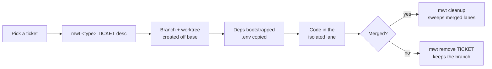
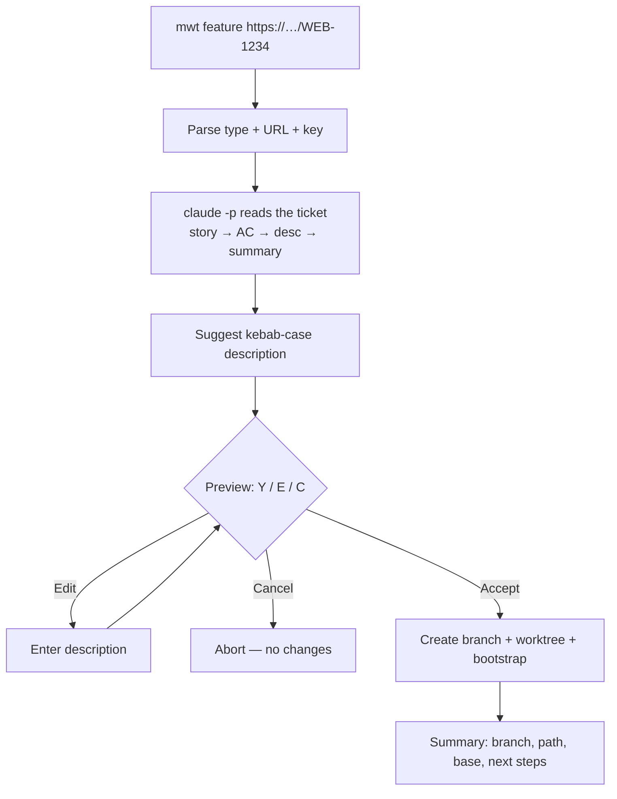
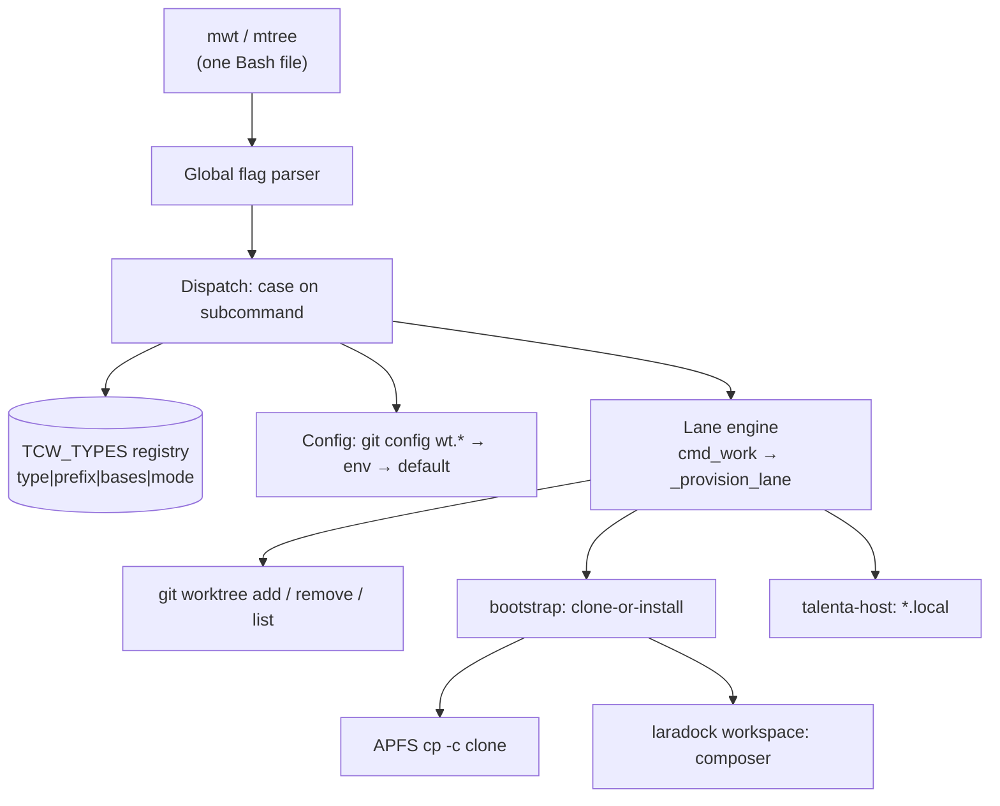

# PRD — Mekari Git Worktree

**Version:** mtree v1.0.6 · **Date:** 2026-06-28

---

## Problem Statement

A monorepo checkout is a single desk. In `talenta-core` (PHP/Laravel + Vue, ~minutes-long Composer + Yarn rebuilds), every context switch — reviewing a teammate's PR, jumping on a hotfix, running two tickets in parallel — means `git stash`, `git checkout`, and waiting for dependencies to rebuild against a different lockfile, then doing it all again to switch back. `git worktree` already solves the underlying problem (multiple working directories off one `.git` object store), but the raw plumbing is fiddly, error-prone, and easy to leave in a corrupt state. The cost of *not* solving this is paid every day, per developer, in dead time and broken local environments — and it compounds now that AI coding agents (Claude Code) want their own isolated, ready-to-run checkout to operate in.

**Who experiences it:** every engineer working in `talenta-core` (and, increasingly, the Go services), plus the AI agents they dispatch.

---

## Goals

1. **Collapse a context switch from minutes to one command.** Starting, resuming, reviewing, or hotfixing a branch in its own isolated, dependency-ready working directory should be a single invocation with no manual `git worktree`/`stash`/`install` choreography.
2. **Make parallel work safe by default.** Two tickets (or two agents) running side by side must never corrupt each other's or the main checkout's dependencies, env, or git metadata.
3. **Make new ticket types a data edit, not a code change.** Adding a workflow category (a new Jira issue type) should be a one-row table edit that instantly works as both `work <type>` and a bare `<type>` subcommand.
4. **Be repo-agnostic with talenta-core as the tuned default.** Core commands work in any git repo; talenta-core-specific behavior (platform split, Docker bootstrap, local hostnames) activates only when relevant.
5. **Leave the workspace cleaner than it found it.** Teardown is one command, never `rm -rf`; merged lanes self-garbage-collect; health is inspectable on demand.

---

## Non-Goals

- **Replacing `git` or hiding worktrees.** mtree is a thin, legible wrapper over `git worktree`; users can always drop to raw git. *Rationale: trust and escape hatches matter more than total abstraction for a daily-driver dev tool.*
- **Cross-platform (Linux/Windows) support.** macOS/APFS assumptions (copy-on-write `cp -c`, BSD `awk`, `stty` sizing) are deliberately load-bearing. *Rationale: the entire target audience is on macOS; supporting other OSes would forfeit the reflink speed win.*
- **A package/build/test toolchain.** The program is intentionally one self-contained Bash file with no dependencies, build step, or CI. *Rationale: zero-install portability and "it's just one file you can read" are features.*
- **Managing remote branches or PRs.** mtree never pushes, deletes remotes, or opens PRs; it operates on local worktrees and branches only. *Rationale: separation of concerns — remote/PR lifecycle belongs to git/Bitbucket tooling (`pull-request` skill, `daily-driver`).*
- **A general dependency manager.** It bootstraps `vendor`/`node_modules`/Go modules by *delegating* to composer/yarn/go; it does not resolve or pin versions itself. *Rationale: the package managers are the source of truth; mtree only materializes them per lane.*
- **A Jira client or an LLM API client.** The AI-assisted flow (Upcoming Features) does **not** embed Jira API tokens or call an LLM API directly; it delegates ticket retrieval and description generation to the already-authenticated `claude` CLI (Atlassian MCP). *Rationale: keeps mtree a single, credential-free Bash file and reuses the auth the engineer already has.*

---

## Core Features

| Feature | What it does |
|---|---|
| One-command lanes | `<type> <TICKET> [desc]` creates a role-named branch + isolated worktree off the right base, then bootstraps deps — no stash / checkout / reinstall churn |
| Concurrency lane model | A few long-lived directories pinned to roles (main, mobile, work, hotfix, review, scratch) all sharing one `.git` object store |
| Ticket types as data | A registry table maps each Jira issue type to its prefix + base branches; adding a row adds a working subcommand |
| Clone-or-install bootstrap | Deps materialized via APFS copy-on-write when the lockfile matches main, else a real install; `.env` copied; dep dirs never symlinked |
| Platform split *(talenta-core)* | `--web` / `--mobile` pick the Web vs Mobile-API base from one command |
| laradock integration *(talenta-core)* | `composer install` runs inside the `workspace` container (PHP 7.4 parity); a lane resolves on host and in `/var/www` |
| Per-lane local URL *(talenta-core)* | Each lane registers a deterministic `*.local` hostname for instant browser access |
| Safe lifecycle | `remove` keeps the branch and never touches remotes; `cleanup` sweeps merged lanes; `doctor` reports health |
| Agent-ready | `--json` output, the `claude` launcher, and `batch` provisioning for automation and AI agents |
| AI-assisted creation *(upcoming)* | Paste a Jira URL → Claude suggests a branch description → approve / edit → lane created |

---

## User Flow

**Standard lane lifecycle** — start a ticket, work it in isolation, tear it down without remote side effects.

**AI-assisted creation from a Jira URL** *(upcoming)* — minimize input, keep the engineer in control of the final name.

---

## Architecture

mtree is a **single self-contained Bash file** (~1000 lines, `set -euo pipefail`). There is no build system, package manager, or test runner. "Architecture" therefore means the cross-cutting patterns, not a module graph: a flag parser feeds a `case` dispatch, every ticket type routes through one provisioning engine, and per-repo config + a stack-aware bootstrap make it work beyond talenta-core.

**The lane model.** All tool-created lanes live under one container next to the main checkout — `<parent>/<repo>-worktrees/<repo>-<suffix>` — each pinned to a role, all sharing one `.git`:

| Lane | Role | Branch | Lifetime |
|---|---|---|---|
| `main` | The clean primary checkout — source of truth, never removed | the repo's base (e.g. `develop`) | persistent |
| `mobile` | Standing lane off the Mobile-API base, kept ready so it's never re-provisioned | `master-mobile-api` | persistent *(talenta-core)* |
| `work` | One per ticket, created on demand, run in parallel | `<prefix>/<TICKET>[-desc]` | per ticket |
| `hotfix` | Urgent patch off the production base, in-flight work untouched | `hotfix/<TICKET>` | per ticket |
| `review` | A colleague's PR branch for read/run; one at a time | detached at `origin/<branch>` | transient |
| `scratch` | Throwaway experiments | detached at `HEAD`, in `/tmp/tc-<name>` | throwaway (purged on reboot) |

| Layer | Responsibility | Key functions |
|---|---|---|
| Dispatch + type registry | Parse global flags, route the subcommand; ticket types are data rows, not code | bottom-of-file `case`, `TCW_TYPES`, `_type_row` |
| Lane engine | Create/reuse the branch, add the worktree, lock long-lived (integration) lanes | `cmd_work`, `_provision_lane`, `_resolve_lane` |
| Config resolution | `git config wt.<key>` → env → inferred default; repo discovery from inside any worktree | `_resolve_base`, `git worktree list --porcelain` |
| Bootstrap | Per-stack dep provisioning; clone-or-install; `.env` copy | `bootstrap`, `_provision`, `_provision_go` |
| Docker coupling | composer inside laradock; relativized `.git` links; host↔container path map | `_composer_install_in_container`, `_relativize_worktrees`, `_docker_path` |
| Host integration | register/unregister `*.local` via the companion script; never abort git on host failure | `_register_host`, `_unregister_host` |
| Output modes | human → stdout; `--json` → result line on stdout with all chatter on stderr | `_say`, `_emit` |
| Interactive REPL | alt-screen banner + readline prompt; each command a guarded one-shot subprocess | `_enter_interactive`, `cmd_shell` |

---

## Tech Stack

| Concern | Technology | Notes |
|---|---|---|
| Language / runtime | Bash (`set -euo pipefail`) | one self-contained file, ~1000 lines, zero install |
| VCS substrate | `git worktree` | multiple checkouts off one shared `.git` object store |
| Dependency isolation | APFS copy-on-write (`cp -c -R`) | near-instant, ~0 disk until divergence; macOS-only (load-bearing) |
| Quality gate | `bash -n` (+ optional `shellcheck`) | no test runner or CI by design |
| Package managers | Composer · Yarn · Go modules | delegated, never reimplemented; auto-selected by which manifest `MAIN` has |
| Container runtime | Docker + laradock | composer runs in the `workspace` container for PHP 7.4 parity |
| Local hostnames | `talenta-host` companion (nginx vhost + `/etc/hosts`) | per-lane `*.local` + `APP_URL` |
| Configuration | `git config wt.*` + environment variables | per-repo, layered resolution |
| AI integration *(upcoming)* | `claude` CLI (headless `-p`) + Atlassian MCP | Jira retrieval + description generation; no embedded credentials |
| Terminal UX | ANSI / alt-screen via `tput`, `stty` sizing, Mekari-purple banner | width-aware tables, full-screen REPL |

**Target repos:** `talenta-core` (PHP/Laravel + Vue) as the tuned default; Go services (e.g. `employee-management-service`); repo-agnostic for the core commands.

---

## User Stories

### IC engineer (talenta-core)

| I want to… | So that… |
|---|---|
| Start a ticket's branch in a ready-to-run directory with one command (`mwt bugfix TM-1 npe`) | I can begin coding without stashing, branching, or waiting on a reinstall |
| Create a lane by pasting a Jira URL (`mwt feature https://…/WEB-1234`) and get a convention-following description suggested for me | I don't hand-craft names, yet still approve or edit before anything is created |
| Run two tickets in parallel in fully isolated lanes | PROJ-1 and PROJ-2 (or two agents) never collide on deps or env |
| Resume an existing local-or-remote branch in a lane (`mwt resume <branch>`) | I can pick work back up — pointed to it if already checked out, not blocked by git's refusal |
| Review a colleague's PR in a throwaway detached lane (`mwt review <branch>`) | I can read and run their code without disturbing my in-flight work |
| Spin up a hotfix off the production base with no platform ceremony (`mwt hotfix TM-1`) | urgent patches don't require me to remember the base branch |
| Target the Web or Mobile-API base from one command (`--web`/`--mobile`) | one tool covers both deploy targets |
| Tear down a lane safely (`mwt remove TM-1`), keeping the branch, never touching remotes | uncommitted work hard-stops me unless I `--force` |
| Have merged, clean lanes swept automatically (`mwt cleanup`) | disk and clutter don't accumulate |
| Get a health report (`mwt doctor`) for symlinked deps, `.env` drift, prunable/locked worktrees | I catch a corrupt lane before it bites |
| Reach each lane at its own `*.local` URL | I can open any in-flight branch in a browser without port juggling |

### Tech lead / tooling owner

| I want to… | So that… |
|---|---|
| Add a new ticket type by editing one registry row | workflow changes don't touch command logic |
| Have every tunable resolve per-repo (`git config wt.*` → env → default) | the same script behaves correctly across talenta-core, Go services, and any repo |
| Keep the tool one auditable file with a single `bash -n` gate | contributions are trivial to review and ship |

### AI coding agent / automation

| I want… | So that… |
|---|---|
| A machine-readable result object (`--json`) on stdout, human chatter on stderr | I can provision lanes programmatically |
| To be launched directly into a ticket's isolated lane (`mwt claude TM-1 …`) | I work in a clean checkout that won't race the human's main desk |
| To batch-provision many lanes from a file (`mwt batch <file>`) | I can stand up a sprint's worth of worktrees at once |
| To pass a Jira URL and auto-accept the AI suggestion (`--yes`/`--json`) | I provision a correctly-named lane from a ticket with no prompt |

---

## Requirements

### Must-have — core (P0)

| ID | Requirement | Key acceptance criteria |
|---|---|---|
| P0-1 | Lane lifecycle engine (create / resume / remove) | Creates `<prefix>/<TICKET>[-desc]` off the resolved base, or reuses the branch • already-checked-out → points there, no error • non-Jira key → warns but continues • `remove` deletes the lane, keeps the branch, never touches remotes |
| P0-2 | Ticket types as data, not code | Registry row `type\|prefix\|web-base\|mobile-base\|mode` enables `work <type>` and bare `<type>` • built-ins: bugfix, subtask, fasttrack, task, story, improvement, techdebt(chore), feature, epic, spike • `epic` = integration mode (locked) • no type → `feature` |
| P0-3 | Dependency bootstrap — clone-or-install, never symlink | Lockfile matches main → APFS COW clone; else real install • symlinking dep dirs rejected (corrupts main, races agents) • `--no-bootstrap` skips • stack auto-selected by manifest (Go vs PHP); Go is exclusive of composer/yarn |
| P0-4 | Per-repo, layered config | Resolves `git config wt.<key>` → env → inferred default • base: `wt.base` → `$TCW_BASE` → `origin/HEAD` → develop/main/master → current branch • works from inside any worktree |
| P0-5 | Safe teardown & garbage collection | `remove` blocks on uncommitted work unless `--force` (which also unlocks locked) • never blind `rm -rf` • `cleanup` removes only clean + merged lanes (ancestry or `git cherry`), skips main/mobile/locked/dirty/detached with reasons • empty container `rmdir`'d |
| P0-6 | Inspection & health | `ls` width-aware table never overflows • `doctor` flags symlinked deps, `.env` key drift, prunable/locked, per-lane disk • `path <suffix>` prints an absolute path |
| P0-7 | Idempotent setup (`init`) | Validates the repo (non-talenta origin hard-fails unless `--force`) • creates `.worktreeinclude`, installs `mtree`/`mwt` aliases, provisions the mobile lane • re-run reports "No action required" |

### Must-have — talenta-core specific (P0)

| ID | Requirement | Key acceptance criteria |
|---|---|---|
| P0-8 | Web/Mobile platform split | `--web` (default) / `--mobile` selects the base column; `--base` overrides • `hotfix [web\|mobile] <TICKET>` defaults to web off the production base |
| P0-9 | laradock/Docker coupling for PHP parity | `composer install` always runs in the laradock `workspace` container (PHP 7.4), failing loudly if down • `.git` links relativized so a lane resolves on host and in `/var/www` 1:1 |
| P0-10 | Per-lane local hostname | Register/unregister a deterministic `*.local` host (vhost + `/etc/hosts` + `APP_URL`) via `talenta-host` • a host failure never aborts the git op (warn only) |

### Nice-to-have (P1)

| ID | Requirement |
|---|---|
| P1-1 | `--json` machine output — single result object on stdout, all human output to stderr; `1>&2` preserved on git-mutating calls |
| P1-2 | `claude` launcher — resolves a ticket/branch/suffix to a lane (or cwd), `cd`s in, `exec`s claude with args; bypasses the REPL alt-screen |
| P1-3 | Interactive REPL — a bare `mtree`/`mwt` in a TTY opens an alt-screen banner + prompt; each command runs as a guarded one-shot subprocess |
| P1-4 | `batch <file>` — provisions many lanes from `<type> <TICKET> [desc]` lines (CRLF-tolerant, `#` comments); reports created/failed |
| P1-5 | `scratch [name]` — throwaway detached lane in `/tmp` with a purge warning |
| P1-6 | `resume` fuzzy lane resolution — token → directory, most-specific-first; ambiguous matches refuse and list candidates |
| P1-7 | `sync-env` — re-copies `.env` from main, then re-applies the lane's hostname/`APP_URL` |

---

## Upcoming Features

Forward-looking work, not in v1.0.6. The headline addition is AI-assisted lane creation; the rest is roadmap that the current design is built to accommodate.

### AI-Assisted Lane Creation from a Jira URL

A new input form for the lane engine: `<type> <jira-url>` provisions a lane whose description is **inferred from the Jira ticket by Claude**, after a human-approved preview. It removes the manual `[desc]` step while keeping the engineer in final control of the name. It is *additive* — it reuses the existing provisioning engine (P0-1/P0-3), the type registry (P0-2), and config/base resolution (P0-4), adding three new pieces: a URL parser, a Claude-delegated retrieval + generation step, and an interactive approval gate (the first interactive element in the otherwise non-interactive `cmd_work`).

**Architecture constraint (load-bearing):** mtree stays a single, credential-free Bash file. It does **not** embed Jira tokens or call an LLM API directly — it delegates to the `claude` CLI in headless mode (`claude -p`), which already has the Atlassian MCP connected and authenticated, to fetch the ticket and return a structured suggestion as JSON. This mirrors the existing `claude`/`talenta-host` shell-out pattern (and inherits its caveat — the MCP may be absent in headless/cron contexts; see Open Questions).

| ID | Capability | Behaviour & key acceptance |
|---|---|---|
| AI-1 | Input parsing & validation | Accept `<type> <jira-url>`; extract type, URL, key • type validated vs registry • URL shape `*.atlassian.net/browse/<KEY>` validated • key matches `^[A-Za-z]+-[0-9]+$` • a Jira URL in the ticket position auto-triggers the flow; manual forms unchanged |
| AI-2 | Ticket retrieval & intent (via `claude -p`) | Reads fields by priority: User Story → Acceptance Criteria → Description → Summary → Labels • returns `{key, suggestion, rationale}` • suggestion reflects the implementation, not the summary verbatim • `claude` missing/auth/timeout → clear error + manual fallback `<type> <KEY> <desc>` |
| AI-3 | Description generation & naming rules | 2–6 words, lowercase, kebab-case, implementation-focused; bans update/improve/fix-issue/changes/enhancement • sanitized to `^[a-z0-9]+(-[a-z0-9]+){1,5}$` regardless of model output • e.g. "Employee Import should validate duplicate tax number" → `validate-duplicate-tax-number` |
| AI-4 | Interactive approval gate | Preview (type, key, description, full branch) with [Y] accept · [E] edit · [C] cancel • no git mutation before [Y]; [C] = zero side effects • non-TTY or `--yes`/`--json` auto-accepts; non-TTY without a flag errors, never hangs |
| AI-5 | Manual edit | [E] replaces only the description (re-sanitized, re-previewed); type and key are immutable • `validate-tax-number-import` → `feature/WEB-1234-validate-tax-number-import` |
| AI-6 | Creation via the existing engine | Routes `<prefix>/<KEY>-<desc>` + base through `_provision_lane` • partial failure aborts safely, never reported as success • existing branch/lane → idempotent point-there • composes with `--web/--mobile`, `--base`, `--no-bootstrap` |
| AI-7 | Result summary & next steps | Prints branch, full lane path, base, Ready status, and `cd`/`git status` follow-ups • `--json` extends `_emit` with the suggestion fields |
| AI-8 | Error taxonomy (cause · resolution · retry) | Covers invalid URL, unsupported type, ticket not found, Jira auth/unavailable, Claude unavailable, ambiguous ticket, worktree/branch exists, invalid name, git failure • ambiguous ticket still offers [E] • transient errors advise retry, deterministic ones don't |
| AI-9 | Logging for troubleshooting | Records the parsed input, the prompt, the raw response, and each git step; gated so normal output stays clean and `--json` stdout stays pure |

**AI nice-to-haves** (the same feature, later):

| Nice-to-have | Description |
|---|---|
| Suggestion cache | Cache per ticket so re-runs are instant and consistent (softens LLM non-determinism) |
| Base-branch inference | Infer the base from labels (e.g. mobile/hotfix), offered for confirmation, never auto-applied |
| Alternatives | Offer 2–3 candidate descriptions to pick from instead of one |

### Roadmap (design accommodates, not yet built)

| Feature | Description |
|---|---|
| Cross-platform (Linux) dependency strategy | A bootstrap abstraction with a non-APFS reflink fallback (hardlink/overlay) that slots in without rewriting the lane engine. *Today: falls back to a full install.* |
| Additional stack detectors | Extend manifest detection (`go.mod`/`composer.lock`/`yarn.lock`) to Node-only, Python (`poetry.lock`), etc. as data-driven detectors |
| Pluggable host/Docker providers | `talenta-host`/laradock are already isolated behind `_register_host`/`_docker_*`; another repo could supply its own provider via `wt.*` config |

---

## Constraints (load-bearing implementation decisions)

These are *not* incidental — they shaped the requirements and must be honored by any re-implementation:

- **macOS / APFS only.** Copy-on-write `cp -c`, BSD `awk` (no newlines in `-v`), real terminal width via `stty size </dev/tty` (not `tput cols`, which breaks inside `$()`).
- **Single self-contained Bash file.** No build, no deps, no test runner; `set -euo pipefail`; `bash -n` is the only gate. `die()` inside `$(...)` only exits the subshell — callers guard with `|| exit 1`.
- **One branch ↔ one worktree** (git invariant); work/hotfix create fresh branches, review/scratch are detached, so collisions can't happen.
- **Never `git gc` while agents are active** (shared object store).
- **Never symlink dep dirs** (corrupts main; races agents) — clone-or-install only.

---

## Success Metrics

### Leading indicators (days–weeks)
- **Context-switch time:** median time from "I need to look at branch X" to a running, dependency-ready checkout drops from minutes (stash + checkout + reinstall) to **< 30 s warm / one command**. *Measure: self-reported + `time mwt review <branch>` on a warm cache.*
- **Adoption:** ≥ **80%** of active talenta-core engineers have `mwt` aliased and have created ≥1 lane within 30 days of rollout. *Measure: presence of the alias / lane-creation telemetry or survey.*
- **Parallel usage:** ≥ **2** concurrent lanes per active user on a typical day. *Measure: `git worktree list` snapshots / `ls` usage.*
- **Bootstrap success rate:** ≥ **98%** of `work`/`resume`/`review` invocations finish bootstrap without manual dep repair. *Measure: doctor "no issues" rate; failed-install reports.*
- **AI-suggestion acceptance (upcoming feature):** ≥ **60%** of AI-assisted creations accepted with **no edit** ([Y]), and ≥ **90%** with at most a light edit. *Measure: ratio of [Y] vs [E] vs [C]. Below target → tune the generation prompt.*

### Lagging indicators (weeks–months)
- **Corrupted-checkout incidents → ~0.** No reports of a worktree's deps/env leaking into main or two agents racing a directory. *Measure: support/Slack mentions; `doctor` symlink-flag occurrences.*
- **Disk footprint stays flat** despite N lanes (reflinks mean ~0 disk until divergence). *Measure: `doctor` disk column over time.*
- **Agent throughput:** number of Claude Code tickets worked in parallel per developer increases without local-env breakage. *Measure: `mwt claude` invocations vs incident rate.*

> **Targets are hypotheses** to validate post-rollout; revise once telemetry exists (today the tool emits none).

---

## Open Questions

- **[data] No telemetry exists.** How will adoption, bootstrap success, and context-switch time actually be measured? Add opt-in counters, or rely on surveys + `doctor` snapshots? *(non-blocking, but blocks the metrics above)*
- **[eng] No automated tests.** Is `bash -n` + manual exercise sufficient long-term, or should a lightweight `bats` smoke suite gate the riskier paths (`cleanup` merge-detection, `remove` dirty-guard, COW fallback)? *(non-blocking)*
- **[eng] Cross-platform demand.** Is there real pull for Linux support (CI containers, non-Mac engineers), which would force the reflink-fallback design (Upcoming Features) now rather than later? *(blocking only if Linux is in scope)*
- **[stakeholder] Distribution.** Brew formula vs symlink-on-PATH vs vendored-in-repo — which install path do we standardize and document? *(non-blocking; affects onboarding friction)*
- **[eng] Go-service hostname/Docker story.** Go lanes skip laradock/host registration today; do the Go services need an equivalent local-URL/containerized-bootstrap path? *(non-blocking)*
- **[eng/product] AI-assist determinism vs. the "deterministic" UX goal.** LLM output is *not* byte-identical across runs, so the same Jira URL may yield different suggestions. The **human approval gate (AI-4) is the determinism guarantee** — the final name is always engineer-controlled. Do we also want a low-temperature setting + suggestion cache to make repeat runs stable? *(non-blocking; affects how we word the "deterministic" promise)*
- **[eng] Claude/Jira availability assumption.** The AI form requires the `claude` CLI on PATH **with the Atlassian MCP connected and authenticated** — which may be absent in headless/cron/CI. Is the manual fallback (`<type> <KEY> <desc>`) sufficient, or do we need a degraded "fetch summary only" path? *(blocking for any automated/cron use of the AI form)*
- **[product] Cost & latency of delegating to `claude -p`.** Each AI-assisted creation spends an LLM call (seconds of latency, token cost). Acceptable interactively; do we cap or batch it for `batch <file>` over many URLs? *(non-blocking)*
- **[eng] Jira host allow-list.** AI-1 validates `*.atlassian.net`; should the host be configurable (`git config wt.jiraHost`) for other instances, or hard-pinned to `jurnal.atlassian.net`? *(non-blocking)*

---

## Timeline Considerations

- **No hard external deadlines.** This is internal developer tooling shipped incrementally (tool → docs → icon → published guide → host integration).
- **Dependencies:** talenta-core-specific features depend on the companion `talenta-docker-dev` repo (laradock + `bin/talenta-host`); those must be present and current for P0-8/9/10.
- **Suggested phasing if rebuilt from scratch:**
  1. **Phase 1 (core, repo-agnostic):** lane engine + type registry + config resolution + bootstrap (clone-or-install) + `ls`/`remove`/`cleanup`/`doctor`. *(P0-1..7)*
  2. **Phase 2 (talenta-core):** platform split + laradock composer-in-container + relativized worktrees + `talenta-host`. *(P0-8..10)*
  3. **Phase 3 (ergonomics & automation):** `--json`, `claude` launcher, interactive REPL, `batch`, `scratch`, `sync-env`. *(P1-*)*
  4. **Phase 3.5 (AI-assisted creation):** Jira-URL input → `claude -p` retrieval/generation → approval gate → existing engine. Depends on Phase 1 (engine) **and** Phase 3's `claude`/`--json` plumbing. *(Upcoming Features: AI-*)*
  5. **Phase 4 (reach):** cross-platform reflink fallback, additional stacks, pluggable providers. *(Upcoming Features: roadmap)*

- **Dependency for the AI form:** the engineer's `claude` CLI must have the Atlassian MCP connected (see Open Questions) — a soft dependency that degrades to the manual path when absent.

---

## Appendix — Command surface

| Command | Purpose |
|---|---|
| `work <type> <TICKET> [desc]` / `<type> <TICKET> [desc]` | Create a lane off the type's base, then bootstrap |
| `<type> <jira-url>` *(upcoming)* | AI-assisted: read the Jira ticket via `claude`, suggest a kebab-case description, preview/approve/edit, then create the lane |
| `resume <branch> [suffix]` (`continue`, `cont`) | Continue an existing local/origin branch in its own lane |
| `hotfix [web\|mobile] <TICKET>` | `hotfix/<TICKET>` off the production base (defaults to web) |
| `review <branch>` | Detached lane at `origin/<branch>` (the PR source branch) |
| `scratch [name]` | Throwaway detached lane in `/tmp` |
| `batch <file>` | Provision many lanes from a file |
| `claude [target] [args…]` | Launch Claude Code in a lane |
| `init` | Idempotent setup (talenta-core) |
| `mobile` | Persistent Mobile-API lane (talenta-core) |
| `remove <TICKET> [--force]` | Drop a lane, keep the branch |
| `cleanup` | Remove clean, merged lanes |
| `ls` / `list` | List all worktrees |
| `path <suffix>` / `go` | Print a lane's path |
| `bootstrap <path>` | (Re)provision `.env` + deps |
| `sync-env <path>` | Re-copy `.env` from main |
| `doctor` | Health report |
| `types` | List the ticket-type registry |
| `help` | Full command list |

**Flags:** `--web` / `--mobile` (platform), `--base <branch>`, `--no-bootstrap`, `--json`, `--force` / `-f`, `--yes` / `-y` *(upcoming — auto-accept the AI suggestion, for non-TTY/automation)*.
